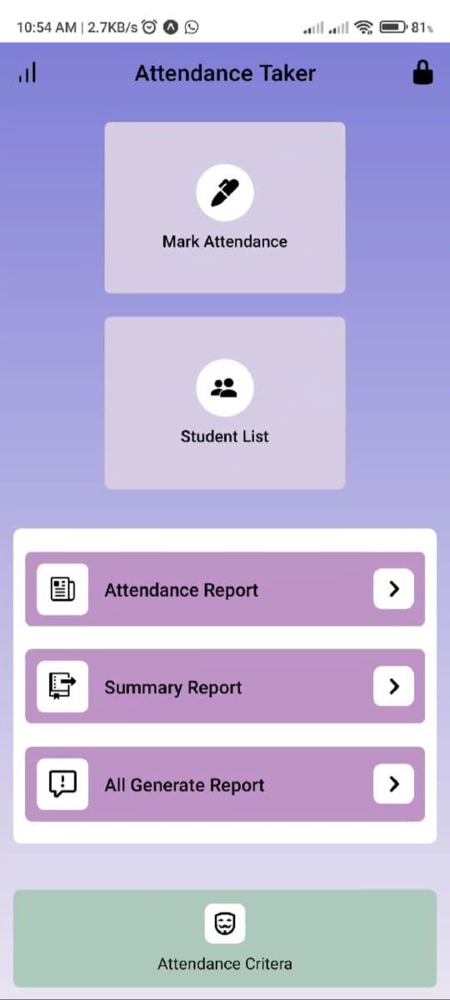
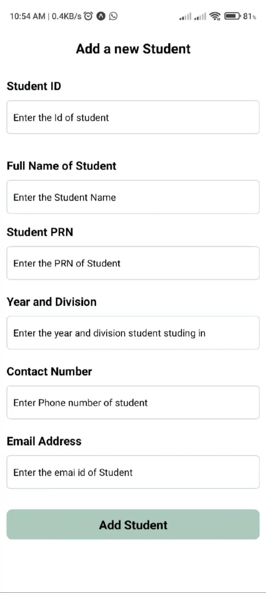
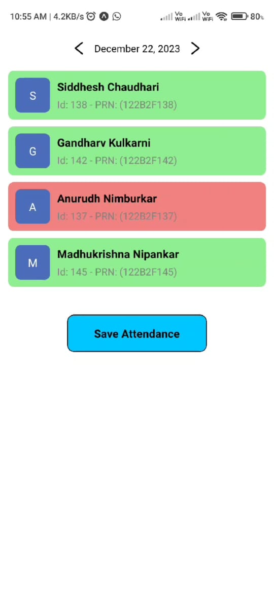

# AttendanceTaker

AttendanceTaker is an innovative app designed to streamline the attendance marking process for professors. It empowers educators with a sophisticated attendance application built using React Native, MongoDB, Node.js, and Git.

## About

- **ClassEase:** AttendanceTaker simplifies the traditional methods of attendance tracking, providing a convenient, time-saving solution for academic institutions.
- **Efficient Management:** It enables professors to efficiently manage and track student attendance with a user-friendly interface.

## Technologies Used

- React Native
- MongoDB
- Node.js
- Git

## Installation

To get started with AttendanceTaker, follow these steps:

1. Clone the repository:

```
git clone https://github.com/Siddc11/AttendanceTaker.git
```

2. Navigate to the project directory:

```
cd AttendanceTaker
```

3. Install dependencies:

```
npm install
```

## Screenshots: 
<div>
    
    
</div>
<div>
   
    
</div>
